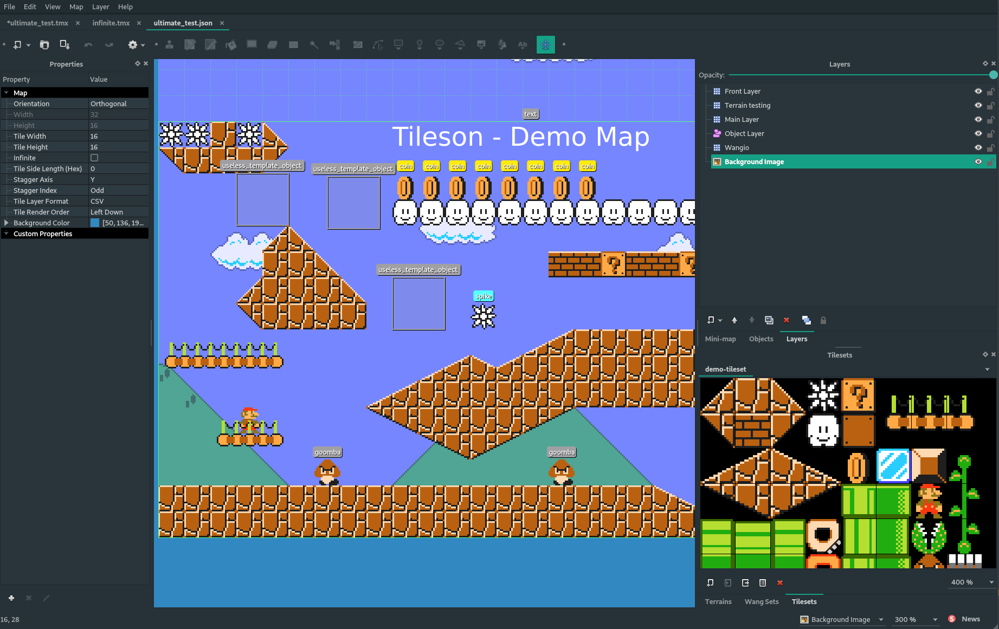
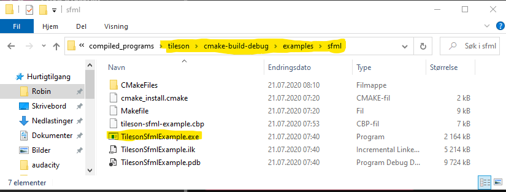
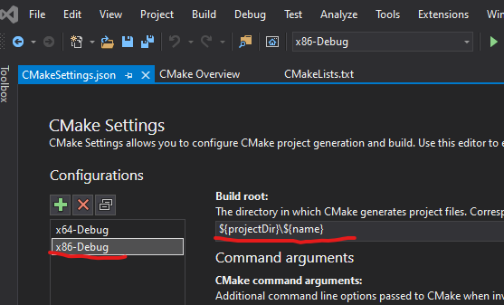
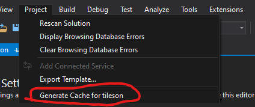

[](https://github.com/SSBMTonberry/tileson/actions/workflows/test_verification.yml) [](https://github.com/SSBMTonberry/tileson/actions/workflows/pages/pages-build-deployment)

# Tileson
Tileson is a modern and helpful cross-platform json-parser for C++, used for parsing Tiled maps.

Tileson utilizes modern C++ (C++17) to create a stable, safe and helpful, but fast, parser for Tiled maps.
Including classes and functions to make it easier to use the Tiled data in your game. 
Tileson supports Tiled maps up to version `1.6.0`, but will probably be able to parse
maps made with newer versions of Tiled just as well.

Be sure to take a look at the release notes to see what's new!

### Tileson is header-only
This means that all you need is one file, `tileson.hpp` to have Tileson going
in your project! The single-file is generated using only ~7000 lines of code with everything included. There is also a `tileson_min.hpp` where no Json parser is bundled. See the `extras` folder for supported Json backends.

You may alternatively copy the `include` directory and all its contents if you
want to have every component in their own file. This will probably be less heavy on your IDE, but you will still only need to include the `tileson.h` file in the top level.

**Content:**
- [Documentation](#documentation)
- [How to contribute](#how-to-contribute)
- [Unreleased features available in the master-branch](#unreleased-features-available-in-the-master-branch)
- [What is new in v1.3.0](#what-is-new-in-v1.3.0)
- [Tiled features not yet supported](#tiled-features-not-yet-supported)
- **Parsing:**
  - [How to parse Tiled maps](#how-to-parse-tiled-maps)
  - [Parsing worlds](#parsing-worlds)
  - [Parsing Tiled-projects](#parsing-tiled-projects)
  - [Parsing LZMA compressed maps](#parsing-lzma-compressed-maps)
  - [Using an alternative Json parser](#using-an-alternative-json-parser)
- [Compiling](#compiling)
  - [Windows](#windows)
  - [Linux](#linux)
  - [OSX](#osx)
- [Examples](#examples)
- [Generating the single-header](#generating-the-single-header)
- [Libraries used by Tileson](#libraries-used-by-tileson)
- [Optional Json parsers supported by Tileson](#optional-json-parsers-supported-by-tileson)
- [Libraries used in examples](#libraries-used-in-examples)

# Documentation

There is a `Doxygen` generated documentation of Tileson that can be found [HERE](https://ssbmtonberry.github.io/tileson/html)

### IMPORTANT: Tileson requires that everything it needs in a map is embedded into it, to be able to resolve their related objects (with the exception of external Tilesets, which is supported in json format since v1.3.0). Maps having dependencies to external objects etc. will not work properly.

# How to contribute
You are free to post any issue requesting new features, reporting bugs or asking questions at any time.
If you want to contribute in the development of `Tileson`, make sure you read the [CONTRIBUTION GUIDELINES](CONTRIBUTION.md)
before you start doing anything.

# Unreleased features available in the master-branch
- Fixed some Apple Clang 13 compile warnings ([#84](https://github.com/SSBMTonberry/tileson/issues/84)) - Thanks to [dmlary](https://github.com/dmlary)
- Added `quom` as amalgamate tool for `OSX` ([#82](https://github.com/SSBMTonberry/tileson/issues/82)) - Thanks to [dmlary](https://github.com/dmlary)
- Added missing properties to `tson::Text` ([#75](https://github.com/SSBMTonberry/tileson/issues/75))
- Tiled 1.9 support ([#68](https://github.com/SSBMTonberry/tileson/issues/68))
- Tiled 1.8 support (**Partial!** See issue for more details) ([#60](https://github.com/SSBMTonberry/tileson/issues/60))
- C++20 support ([#53](https://github.com/SSBMTonberry/tileson/issues/53)) - Thanks to [gamecoder-nz](https://github.com/gamecoder-nz)
- Updated Catch2 to support `GCC 11.2` ([#59](https://github.com/SSBMTonberry/tileson/issues/59))
- Tile properties should now be properly loaded when using multiple tilesets. ([#54](https://github.com/SSBMTonberry/tileson/issues/54)) - Thanks to [Laguna1989](https://github.com/Laguna1989)
- Now using `Github Actions` instead of `Travis` for CI ([#50](https://github.com/SSBMTonberry/tileson/issues/50)) - Thanks to [Laguna1989](https://github.com/Laguna1989)
- Added missing virtual destructor to IJson and IDecompressor. ([#47](https://github.com/SSBMTonberry/tileson/issues/47)) - Thanks to [matthew-nagy](https://github.com/matthew-nagy)

# What is new in v1.3.0
- Animations are now handled by an own `tson::Animation` object, which is also now showcased with a working animation in the example program ([#40](https://github.com/SSBMTonberry/tileson/issues/40), [#32](https://github.com/SSBMTonberry/tileson/issues/32))
- Fixed a bug in `tson::Frame` where you would get the wrong tile ID stored. ([#41](https://github.com/SSBMTonberry/tileson/issues/41))
- `tson::Layer`: Function `getTransparentcolor()`renamed to `getTransparentColor()` ([#38](https://github.com/SSBMTonberry/tileson/issues/38)) - Thanks to [RobLoach](https://github.com/RobLoach)
- Tiled v1.6 support. ([#37](https://github.com/SSBMTonberry/tileson/issues/37))
- Tiled v1.5 support. ([#34](https://github.com/SSBMTonberry/tileson/issues/34))
- Support for external tilesets ([#33](https://github.com/SSBMTonberry/tileson/issues/33))
- `tileson.hpp` and `tileson_min.hpp` is now located in root folder. ([#36](https://github.com/SSBMTonberry/tileson/issues/36))
- See release notes for more details!
  ### From the v1.3.0 alpha release:
- Tileson now uses a `tson::IJson` abstraction layer, which means the user is no longer restricted to use one Json parser. In fact, there are now three parsers with default implementations: `Json11`, `Nlohmann` and `Picojson`. You may even create your own!
- The code base of Tileson is reduced from ~26000 to ~7000 lines of code. In addition Tileson is slightly faster due to switching default/main backend from `Nlohmann` to `Json11`.
- Tileson now has support for reading `LZMA` compressed maps using [PocketLzma](https://github.com/SSBMTonberry/pocketlzma).  Example: The `ultimate_test.json` map gets reduced from `68,6 KiB` to `2,4 KiB` when LZMA compressed.

# Tiled features not yet supported
- Support for collection of images ([#30](https://github.com/SSBMTonberry/tileson/issues/30))

# What is Tiled?
Tiled is a general purpose map editor developed by `Thorbjørn Lindeijer`.
Tiled is perfect if you want to create any map for 2D games, and is very popular.
Many commercial games have used it as their goto map editor. 
A few popular games that have used Tiled: `Shovel Knight`, `Axiom Verge` and `ScubaDiver`.


 

Tiled can be found here:
- [Homepage](https://www.mapeditor.org/)
- [GitHub](https://github.com/bjorn/tiled)

# How to parse Tiled maps
Parsing a Tiled json 
```c++
#include "tileson.hpp"

//Tileson uses an alias fs for std::filesystem.
int main()
    tson::Tileson t;
    std::unique_ptr<tson::Map> map = t.parse(tson_files::_ULTIMATE_TEST_JSON, tson_files::_ULTIMATE_TEST_JSON_SIZE);

    if(map->getStatus() == tson::ParseStatus::OK)
    {
        //Get color as an rgba color object
        tson::Colori bgColor = map->getBackgroundColor(); //RGBA with 0-255 on each channel

        //This color can be compared with Tiled hex string
        if (bgColor == "#ffaa07")
            printf("Cool!");

        //Or you can compare them with other colors
        tson::Colori otherColor{255, 170, 7, 255};
        if (bgColor == otherColor)
            printf("This works, too!");

        //You can also get the color as float, transforming values if they are already in their int form, from max 255 to 1.f
        tson::Colorf bgColorFloat = bgColor.asFloat();

        //Or the other way around
        tson::Colori newBg = bgColorFloat.asInt();

        //You can loop through every container of objects
        for (auto &layer : map->getLayers())
        {
            if (layer.getType() == tson::LayerType::ObjectGroup)
            {
                for (auto &obj : layer.getObjects())
                {
                    //Just iterate through all the objects
                }
                //Or use these queries:

                //Gets the first object it finds with the name specified
                tson::Object *player = layer.firstObj("player"); //Does not exist in demo map->..

                //Gets all objects with a matching name
                std::vector<tson::Object> enemies = layer.getObjectsByName("goomba"); //But we got two of those

                //Gets all objects of a specific type
                std::vector<tson::Object> objects = layer.getObjectsByType(tson::ObjectType::Object);

                //Gets an unique object by its name.
                tson::Object *uniqueObj = layer.getObj(2);
            }
        }

        //Or get a specific object if you know its name (or id)
        tson::Layer *layer = map->getLayer("Main Layer");
        tson::Tileset *tileset = map->getTileset("demo-tileset");
        tson::Tile *tile = tileset->getTile(1); //Tileson tile-IDs starts with 1, to be consistent
        // with IDs in data lists. This is in other words the
        //first tile.

        //For tile layers, you can get the tiles presented as a 2D map by calling getTileData()
        //Using x and y positions in tile units.
        if(layer->getType() == tson::LayerType::TileLayer)
        {
            //When the map is of a fixed size, you can get the tiles like this
            if(!map->isInfinite())
            {
                std::map<std::tuple<int, int>, tson::Tile *> tileData = layer->getTileData();

                //Unsafe way to get a tile
                tson::Tile *invalidTile = tileData[{0, 4}]; // x:0,  y:4  - There is no tile here, so this will be nullptr.
                                                                   // Be careful with this, as it expands the map with an ID of {0,4} pointing
                                                                   // to a nullptr...

                //Individual tiles should be retrieved by calling the safe version:
                tson::Tile *safeInvalid = layer->getTileData(0, 5); //Another non-existent tile, but with safety check.
                                                                         //Will not expand the map with a nullptr

                tson::Tile *tile1 = layer->getTileData(4, 4);       //x:4,  y:4  - Points to tile with ID 1 (Tiled internal ID: 0)
                tson::Tile *tile2 = layer->getTileData(5, 4);       //x:5,  y:4  - Points to tile with ID 3 (Tiled internal ID: 2)
                tson::Tile *tile3 = layer->getTileData(8, 14);      //x:8,  y:14 - Points to tile with ID 2 (Tiled internal ID: 1)
                tson::Tile *tile4 = layer->getTileData(17, 5);      //x:17, y:5  - Points to tile with ID 5 (Tiled internal ID: 4)

                //New in v1.2.0
                //You can now get tiles with positions and drawing rect via tson::TileObject
                //Drawing rects are also accessible through tson::Tile.
                tson::TileObject *tileobj1 = layer->getTileObject(4, 4);
                tson::Vector2f position = tileobj1->getPosition();
                tson::Rect drawingRect = tileobj1->getDrawingRect();

                //You can of course also loop through every tile!
                for (const auto &[id, tile] : tileData)
                {
                    //Must check for nullptr, due to how we got the first invalid tile (pos: 0, 4)
                    //Would be unnecessary otherwise.
                    if(tile != nullptr)
                        int tileId = tile->getId(); //A bit verbose, as this is the same as id from the key, but you get the idea.
                }
            }
        }

        //If an object supports properties, you can easily get a property value by calling get<T>() or the property itself with getProp()
        int myInt = layer->get<int>("my_int");
        float myFloat = layer->get<float>("my_float");
        bool myBool = layer->get<bool>("my_bool");
        std::string myString = layer->get<std::string>("my_string");
        tson::Colori myColor = layer->get<tson::Colori>("my_color");

        fs::path file = layer->get<fs::path>("my_file");

        tson::Property *prop = layer->getProp("my_property");
    }
    else //Error occured
    {
        std::cout << map->getStatusMessage();
    }

    return 0;
}
```

### Another quick example to showcase how to get data that can be used to produce drawable objects:
```c++
tson::Tileson t;
std::unique_ptr<tson::Map> map = t.parse(fs::path("./path/to/map.json"));

if(map->getStatus() == tson::ParseStatus::OK)
{
    //Gets the layer called "Object Layer" from the "ultimate_demo.json map
    tson::Layer *objectLayer = map->getLayer("Object Layer"); //This is an Object Layer

    //Example from an Object Layer.
    if(objectLayer->getType() == tson::LayerType::ObjectGroup)
    {
        tson::Object *goomba = objectLayer->firstObj("goomba"); //Gets the first object with this name. This can be any object.

        //If you want to just go through every existing object in the layer:
        for(auto &obj : objectLayer->getObjects())
        {
            tson::Vector2i position = obj.getPosition();
            tson::Vector2i size = obj.getSize();
            tson::ObjectType objType = obj.getObjectType();

            //You may want to check the object type to make sure you use the data right.
        }

        tson::ObjectType objType = goomba->getObjectType();

        /*!
         * tson::ObjectType is defined like this.
         * They are automatically detected based on what kind of object you have created
         * enum class Type : uint8_t
            {
                Undefined = 0,
                Object = 1,
                Ellipse = 2, //<-- Circle
                Rectangle = 3,
                Point = 4,
                Polygon = 5,
                Polyline = 6,
                Text = 7,
                Template = 8
            };
         */

        if (objType == tson::ObjectType::Rectangle)
        {
            tson::Vector2i size = goomba->getSize();
            tson::Vector2i position = goomba->getPosition();

            //If you have set a custom property, you can also get this
            int hp = goomba->get<int>("hp");

            //Using size and position you can can create a Rectangle object by your library of choice.
            //An example if you were about to use SFML for drawing:
            //sf::RectangleShape rect;
            //rect.setSize(sf::Vector2f(size.x, size.y));
            //rect.setPosition(sf::Vector2f(position.x, position.y));
        }
        else if (objType == tson::ObjectType::Polygon)
        {
            for(auto const &poly : goomba->getPolygons())
            {
                //Set a point on a shape taking polygons
            }
            tson::Vector2i position = goomba->getPosition();
        }
        else if (objType == tson::ObjectType::Polyline)
        {
            std::vector<tson::Vector2i> polys = goomba->getPolylines();
            for(auto const &poly : goomba->getPolylines())
            {

            }
            tson::Vector2i position = goomba->getPosition();
        }
    }

    tson::Layer *tileLayer = map->getLayer("Main Layer"); //This is a Tile Layer.

    //You can get your tileset like this, but in v1.2.0
    //The tiles themselves holds a pointer to their related tileset.
    tson::Tileset *tileset = map->getTileset("demo-tileset");

    //Example from a Tile Layer
    //I know for a fact that this is a Tile Layer, but you can check it this way to be sure.
    if(tileLayer->getType() == tson::LayerType::TileLayer)
    {
        //pos = position in tile units
        for(auto &[pos, tileObject] : tileLayer->getTileObjects()) //Loops through absolutely all existing tileObjects
        {
            tson::Tileset *tileset = tileObject.getTile()->getTileset();
            tson::Rect drawingRect = tileObject.getDrawingRect();
            tson::Vector2f position = tileObject.getPosition();

            //Here you can determine the offset that should be set on a sprite
            //Example on how it would be done using SFML (where sprite presumably is a member of a generated game object):
            //sf::Sprite *sprite = storeAndLoadImage(tileset->getImage().u8string(), {0, 0});
            //if (sprite != nullptr)
            //{
            //    sprite->setTextureRect({drawingRect.x, drawingRect.y, drawingRect.width, drawingRect.height});
            //    sprite->setPosition({position.x, position.y});
            //    m_window.draw(*sprite);
            //}
        }
    }
}
``` 

### Parsing worlds

- Tileson now supports `Tiled worlds`. These contains a collection of several maps that can be tied together, but the files themselves must be parsed separately using `Tileson`. (See `examples` to get a full idea how worlds works):

```c++
tson::Tileson t;
tson::World world; 
world.parse(fs::path("path/to/you/file.world"));

//world.get("w1.json") can be used to get a specific map

for(const auto &data : world.getMapData())
{
    std::unique_ptr<tson::Map> map = t.parse(fs::path(world.getFolder() / data.fileName));
    //...
}

```

### Parsing Tiled-projects

- Tileson now supports `Tiled projects`. These contains all `map` and `world` data, but the files themselves must be parsed separately using `Tileson`. (See `examples` to get a full idea how projects works).

```c++
tson::Tileson t;
tson::Project project; 
bool ok = project.parse(fs::path("path/to/you/file.tiled-project"));

for(const auto &folder : m_project.getFolders())
{
    // You can check if a project folder contains a world with -> folder.hasWorldFile()
    // If it does, you can get the world data with -> folder.getWorld()
    for(const auto &file : folder.getFiles())
    {
        std::unique_ptr<tson::Map> map = t.parse(fs::path(folder.getPath() / file.filename()));
        //...
    }
}
```

### Parsing LZMA compressed maps
Tileson supports reading fully LZMA compressed Tiled-maps. 
LZMA compression can greatly reduce your file size, and does not take much longer to load 
compared to regular maps. This requires another single-header library [PocketLzma](https://github.com/SSBMTonberry/pocketlzma) to be included, but it does not require much work. As an example, the `ultimate_test.json` map gets reduced from `68,6 KiB` to `2,4 KiB` when LZMA compressed. Here is a small code example how to read lzma-compressed maps:

```c++
#define POCKETLZMA_LZMA_C_DEFINE //Must be defined once in a source (.cpp)-file before 
#include "pocketlzma.hpp" //Must be declared BEFORE tileson.hpp

#include "tileson.hpp"
int main(int argc, char **argv)
{
    fs::path file {"ultimate_test.lzma"};
    tson::Tileson t;
    std::unique_ptr<tson::Map> map = t.parse(file, std::make_unique<tson::Lzma>());

    return (map->getStatus() == tson::ParseStatus::OK) ? 0 : 1;
}
```

While there are no plans to support other types of compression, you can easily implement your own override of `IDecompressor<std::vector<uint8_t>, std::vector<uint8_t>>` and create support for your own compression. See `include/common/Lzma.hpp` for an example how this is implemented using `PocketLzma`.

### Using an alternative Json parser
Tileson now uses a `tson::IJson` abstraction to make it possible to use several possible Json backends. It even makes it possible for the user to define his/her own IJson implementation using whatever Json library they like. Implementations for `Json11` (default), `Nlohmann` and `Picojson` (there are single-header versions of these libraries in the `extras` folder).

Example:
```c++
#include "nlohmann.hpp" //Must be included before tileson.hpp
#include "picojson.hpp" //Must be included before tileson.hpp

#include "tileson.hpp"

int main(int argc, char **argv)
{
    tson::Tileson j11; //This will use the Json11-backend (default)
    tson::Tileson nlohmann {std::make_unique<tson::NlohmannJson>()}; //Uses the Nlohmann backend
    tson::Tileson picojson {std::make_unique<tson::PicoJson>()}; //Uses the Picojson backend

    tson::Project projectJ11; //This will use the Json11-backend (default)
    tson::Project projectNlohmann {std::make_unique<tson::NlohmannJson>()};
    tson::Project projectPicojson {std::make_unique<tson::PicoJson>()};

    tson::World worldJ11; //This will use the Json11-backend (default)
    tson::World worldNlohmann {std::make_unique<tson::NlohmannJson>()};
    tson::World worldPicojson {std::make_unique<tson::PicoJson>()};
    
    return 0;
}
```

You may notice that there is a `gason.hpp` file inside `include/external` and a `Gason.hpp` inside `include/json`. I tried to make this library work, and it passed the simple tests, but when reading a regular map I experienced memory corruption problems after a few layers was read, which would be hard to figure out. [Gason](https://github.com/vivkin/gason) is thus not supported, but is left there in case someone wants to experiment with it. [Gason](https://github.com/vivkin/gason) is blazingly fast, but also does a lot of memory trickery which I suspect is the reason why I had issues making it work.

# Compiling
The program is cross-platform. It utilizes the features of modern C++ (C++17), which requires the user to have a pretty up to date compiler. Tileson specifically supports the compilers `MSVC` (Windows), `GCC` (Linux) and `Clang` (Mac/OSX), but other compilers supporting all C++17 features should be fine.

As a default, compiling examples are disabled due to CI, but it can easily be enabled through the CMakeLists.txt file on the root level of the project. Also keep in mind that the examples are using content from the `tileson/content` folder and are using relative paths. This is where the executable usually is located when compiling, and must have the same relative path to find the files:

 

## Windows
For compiling the demo on Windows, it's recommended to use either Visual Studio or Visual Studio Code and open the CMakeLists.txt on the root level of the project. Examples for Windows required a `x86`-build in the past, but `x64` should now work just as well! Some screenshots to showcase how CMake should be configured to build the demo using Visual Studio 2019:

#### Locate the CMakeLists.txt in the root of this project

 

#### Configure build to be x86 or x64

 

#### And then





#### Output after full build


## Linux

If you have `GCC7`, `GCC8`, `GCC9`, `GCC10` or newer as a compiler on your system, you should be good to go!
If you are okay with the default settings: Just calling the `cmake CMakeLists.txt` inside the project folder will create a `Makefile` for you. Then you can compile the library by simply calling `make`.

## OSX

`std::filesystem` should be supported by the `Apple Clang`-compiler shipped with the latest version of `Mac OSX`, but may not work with older versions of this OS. If you are using an old version of OSX you can, however, install the newest version of `llvm` via `Homebrew`, which has supported `std::filesystem` for a while.
To generate a solution to be able to build this library, you will need to open the `CMakeLists.txt` file in `CMake`. If `CMake` is not installed on your system, it can easily be found on the internet.

# Examples

You can find examples on how to draw the `demo maps`/`projects` using frameworks like SFML under [examples](https://github.com/SSBMTonberry/tileson/tree/master/examples).
To build this, you will have to enable the CMake flag `BUILD_EXAMPLES`. All examples requires `C++17 std::filesystem` to work, and will fail to build on compilers not supporting this feature.

# Generating the single-header

If Linux is used, a single-header version of Tileson can be generated by calling the 
`amalgamate_script.sh` in the `tools/`folder.
Simply call it like this: `sh amalgamate_script.sh`. There is also a .bat-version of this script for Windows.


# Libraries used by Tileson

- [Catch2](https://github.com/catchorg/Catch2/) - For Unit Tests
- [json11](https://github.com/dropbox/json11) - For JSON read/write
- [PocketLzma](https://github.com/SSBMTonberry/pocketlzma) - For LZMA compression.
- [Amalgamate](https://github.com/SSBMTonberry/Amalgamate) - Fork of [vinniefalco/Amalgamate](https://github.com/vinniefalco/Amalgamate) - For generating single-header include of `tileson.hpp` and `tileson_min.hpp`

## Optional Json parsers supported by Tileson 
- [JSON for Modern C++](https://github.com/nlohmann/json) - At least version 3.9.1
- [Picojson](https://github.com/kazuho/picojson).

The json libraries supported can all be found in a single-header format inside the `extras` folder.

# Libraries used in examples

- [SFML](https://github.com/SFML/SFML) - For drawing maps.
- [Dear ImGui](https://github.com/ocornut/imgui) - For displaying information and managing maps.
- [ImGui-SFML](https://github.com/eliasdaler/imgui-sfml) - To render Dear ImGui with SFML.
